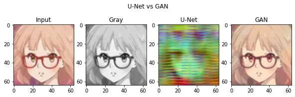

# Assignment

## Introduction

UNet และ GAN โมเดลไหนจะระบายสีได้ดีกว่ากัน !!!

เปรียบเทียบการเติมสีรูปภาพหน้าการ์ตูนขาวดำระหว่างโมเดล Unet และ GAN [อ่านต่อ](https://medium.com/@62015048/unet-และ-gan-โมเดลไหนจะระบายสีได้ดีกว่ากัน-63b406ec493b)

### File Detail

- `Assignment.ipynb` Application to compare input, gray, U-Net output and GAN output
- `anime-face-colorization-GAN-model.ipynb` GAN results by owner model
- `anime-face-colorization-GAN-training.ipynb` GAN result by my traing model
- `anime-face-colorization-U-Net.ipynb` U-Net results

## Author

- 62015044 Songvut Nakrong
- 62015048 Thanatath assavarattanakorn

## Reference

### Application

- [Colorizing Manga Faces with U-Net architectures](https://www.kaggle.com/code/aurbcd/colorizing-manga-faces-with-u-net-architectures/)
- [Anime Face Colorization GAN](https://www.kaggle.com/code/rahuldshetty/anime-face-colorization-gan/)

### Dataset

- [Anime Faces](https://www.kaggle.com/datasets/soumikrakshit/anime-faces)
